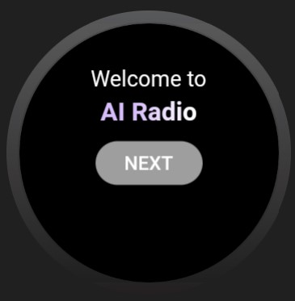
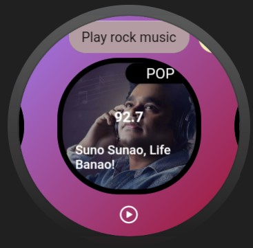

# Wear OS Radio App

Our application is the world’s first deployment of an idea based on network radio where we provide independent radio stations for a smartwatch running Wear OS. This allows the user to consume music content without the dependency of any other external device ( Other than the fact that they need to connect an audio system with the Wear OS device, assuming it doesn’t have a speaker ). We aim to exhibit the deployment of Flutter SDK across underrated platforms and build independent apps for portable environments such as Wear OS.

## Inspiration

We were inspired to design this beautiful. complicated and really useful Application because we recently noticed that no one has ever developed Such a complicated application for WearOS devices which can allow WearOS device to run independently, without any assistance from mobile devices.

## Preview

 

## Working

While Flutter is officially supported on iOS and Android phones, it happily runs on other Android platforms, such as Android for Chrome OS and Wear OS. Flutter isn’t optimized for these devices of devices, but we believe it is possible with the release of flutter 2.0.

Wear OS by Google, formally known as Android Wear 2, is essentially full-stack Android, with a set of libraries for watch-specific functionality and form factors. Wear 1.0 forbade making network connections directly from the device, requiring all data to flow through companion apps on the paired phone. Wear OS removed that restriction, and it’s now possible to write standalone apps on these devices.

While that’s fine, writing Wear apps require developers to pay attention to the watch's specifics: does it have a square or a round watch face, and what are its dimensions; what should the app display when the watch enters ambient mode?
How can Flutter access the Wear APIs, and what patterns can be used to expose said functionality in an elegant, Flutter-like way?
For long-running Wear apps, supporting ambient mode is critical. Natively holding a wake lock keeps the screen at full brightness and kills battery life.

Flutter provides a mechanism to bidirectionally call between Dart and native platform code, using “MethodChannels.” Functions in either realm can be asynchronously called, and simple data types passed back in response. Data can also be streamed using “EventChannels.”

While Flutter isn’t optimized for Wear devices, experimenting on Wear is possible. Flutter’s widget pattern provides an elegant means of handling Wear-specific functionality that lends itself to writing simple, understandable code.

<ul>
<li><b>View Full working video Here:</b> https://drive.google.com/file/d/12d3zknXBhMTHsPoPNWguTmV03Lavm556/view?usp=sharing</li>
</ul>

## Challenges we ran into

- Compatibility issues with wear OS as all manufacturers provide different specifications os making it compatible with almost every Wear OS was a challenge.
- FM Radio using the internet was an issue in Wear OS.
- While Flutter isn’t optimized for Wear devices, experimenting on Wear is possible. Flutter’s widget pattern provides an elegant means of handling Wear-specific functionality that lends itself to writing simple, understandable code.
- Writing Wear apps require developers to pay attention to the watch's specifics: does it have a square or a round watch face, and what are its dimensions; what should the app display when the watch enters ambient mode? How can Flutter access the Wear APIs, and what patterns can be used to expose said functionality in an elegant, Flutter-like way? For long-running Wear apps, supporting ambient mode is critical. Natively holding a wake lock keeps the screen at full brightness and kills battery life.

## Accomplishments that we're proud of

- We managed to get the radio working in the Wear OS device and managed to optimize the code and UI for any shape and size of wear OS device.
- Integration of the flutter application was the real complicated task because WearOS devices all have different specifications and features available, with many shape and size and therefore making app available for all devices was extremely complicated.
- Integration of Radio inside WearOS without the help of any antenna system was again the tough task.

## What's next for

- For future updates on our app, we are planning to add an offline radio system, a separate music player under the same app, and an enhanced fluid UI/UX for a better user experience.
- We are also planning to design a similar application for IOS devices and Apple watch.

## Goals

- Our main objective for this tech deployment is to create a customizable and accessible standalone internet radio access for all Wear OS users, making it independent of a 2nd party device like an Android Phone.
- To display the flexibility & expanded features of using hybrid application development platforms such as Flutter SDK on platforms such as Android Auto, Wear OS, etc.

## Tech Stack

- <b>Flutter SDK using Dart</b> – Used for creating Frontend and back-end for this World’s First Radio App for Android Wear.
- <b>Rest API</b> - For the back-end design of our app , we have set up an API that gets music content on demand according to the user.
